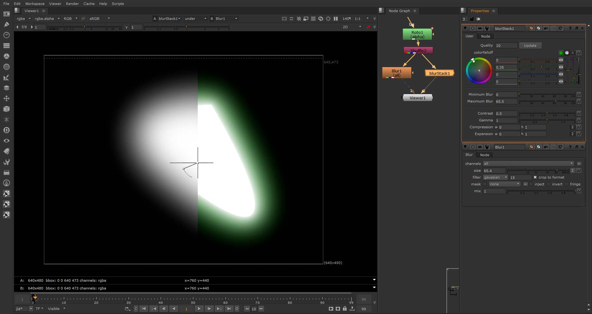

blurStack - A better blur node for Nuke
*******************************************************************************
blurStack is a gizmo that extends the existing blur node within Nuke to give it
finer edge control as well as fringe color, contrast/falloff, and
illumination attributes.

.. toctree::
  :maxdepth: 1
  :hidden:

  blurStack User Guide <blurstackuser>

(left is the regular Nuke blur/right is blurStack)

Download/Install
===============================================================================
Get the latest blurStack at my
`blurStack GitHub Page <http://github.com/ColinKennedy/blurstack>`_

To install blurstack, just drop the *.gizmo* file somewhere within one of your
NUKE_PATH or NUKE_GIZMO_PATH directories.

The GitHub page has information on how to use the node, otherwise, follow this
link :ref:`here <blurstack-user>`.

blurStack's Update
===============================================================================
The update button for blurStack is the only part of the gizmo that is not
dynamic. Changes in value must be refreshed by pressing the "Update" button
because, under the hood, blurStack is being recreated from scratch under the
hood every time the number needs to change.

blurStack Update Documentation
-------------------------------------------------------------------------------
.. automodule:: blurstack
  :members:
  :undoc-members:

