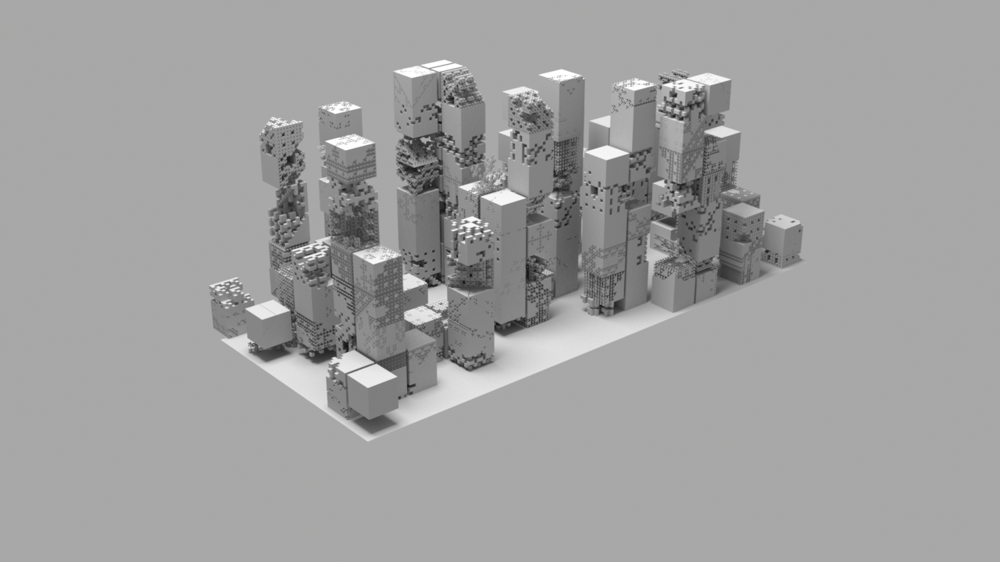

.. VSFX 312 - Advanced Application Scripting documentation master file, created by
   sphinx-quickstart on Thu Feb  4 17:41:34 2016.
   You can adapt this file completely to your liking, but it should at least
   contain the root `toctree` directive.

VSFX 312 - Menger Fractal
*******************************************************************************

.. toctree::
  :maxdepth: 1

  Menger Documentation <tech_312/mengerdocumentation>

.. _`menger zip file`: _images/menger_zip_archive.zip

Project Definition
===============================================================================

The menger fractal is constructed by subdividing a single cube X number of
times, while randomly deleting specific inner parts of the cube. Menger
fractals exist in 2D and 3D variants as long as the math is adjusted
accordingly.

For full project documentation, see this link :doc:`mengerdocumentation`

Goals
==============================================================================
Create a random menger city automatically, with quick iterations between
versions.

.. image:: img/menger_stepped_highQ.jpg
 :align: center

Here I was experimenting with isolating patches of the menger fractal. Given
certain section numbers, the menger fractal can be controlled before subdivision
occurs

.. image:: img/menger_eagle_highQ.jpg
 :align: center

Testing out a sine wave through the menger fractal

.. image:: img/menger_2SPOT5D_highQ.jpg
 :align: center

When a the 4th vertex is pulled down, it makes a 2d menger fractal stretch with
a jagged look which is not unlike it's full 3D counterpart (see below)

Automatic City Generation
==============================================================================

.. raw:: html

        <object width="480" height="385"><param name="movie"
        value="_images/menger_city_generation.mp4"></param><param
        name="allowFullScreen" value="true"></param><param
        name="allowscriptaccess" value="always"></param><embed
        src="_images/menger_city_generation.mp4"
        allowscriptaccess="always"
        allowfullscreen="true" width="700"
        height="385"></embed></object>
          

Creating a field of menger cubes works like so:
  * create a field of cubes in the X and Z direction

    * Keep cubes from intersecting by getting the object-space bounding box
    * Expand the cubes upwards in the Y direction for height
    * initialize menger-related attributes for cube
    * randomize the values of the attributes

  * get the current scene name, move up to the project directory
  * navigate to the data folder and place files there
    * the file name is automatically generated using the scene and object name

  * simulate the rib files for every cube (for one or multiple frames)
  * render the menger

Which, altogether, lets the user create some really fast, rapid prototyping
of different scenes. It also has the added bonus of scaling with the size

of a given scene input and could be extended to follow the normal of a ground
plane with very little additional effort.

.. raw:: html

  <pre style='color:#000000;background:#ffffff;'>def create_menger(object):
      """
  &#xa0;&#xa0;&#xa0;&#xa0;Creates the menger
  
  &#xa0;&#xa0;&#xa0;&#xa0;.. important::
  &#xa0;&#xa0;&#xa0;&#xa0;&#xa0;This script communicates which rib file to render as the current shape   by using the variable outputPath
  
  &#xa0;&#xa0;&#xa0;&#xa0;.. note::
  &#xa0;&#xa0;&#xa0;&#xa0;&#xa0;Currently, file frame padding has been hard-coded to 4. May need to add a variable for
  &#xa0;&#xa0;&#xa0;&#xa0;&#xa0;this in the future, if necessary
  
  &#xa0;&#xa0;&#xa0;&#xa0;.. note::
  &#xa0;&#xa0;&#xa0;&#xa0;&#xa0;This function does not expect arguments but the following attributes must be
  &#xa0;&#xa0;&#xa0;&#xa0;&#xa0;passed through the maya object's shape node..
  
  &#xa0;&#xa0;&#xa0;&#xa0;Args:
  &#xa0;&#xa0;&#xa0;&#xa0;&#xa0;&#xa0;&#xa0;&#xa0;object (&lt;pm.nodetypes.Mesh>): The object to create a menger from
  &#xa0;&#xa0;&#xa0;&#xa0;&#xa0;&#xa0;&#xa0;&#xa0;rootDir (str): The output path of the menger
  &#xa0;&#xa0;&#xa0;&#xa0;&#xa0;&#xa0;&#xa0;&#xa0;depth (int): The number of recursions created before the menger is drawn
  
  &#xa0;&#xa0;&#xa0;&#xa0;&#xa0;&#xa0;&#xa0;&#xa0;.. note::
  &#xa0;&#xa0;&#xa0;&#xa0;&#xa0;&#xa0;&#xa0;&#xa0;&#xa0;&#xa0;&#xa0;&#xa0;freq will not have any effect if amp is 0
  
  &#xa0;&#xa0;&#xa0;&#xa0;&#xa0;&#xa0;&#xa0;&#xa0;animation (bool): Enables/Disables writing/reading .rib files with
  &#xa0;&#xa0;&#xa0;&#xa0;&#xa0;&#xa0;&#xa0;&#xa0;&#xa0;&#xa0;&#xa0;&#xa0;&#xa0;&#xa0;&#xa0;&#xa0;&#xa0;&#xa0;&#xa0;&#xa0;&#xa0;&#xa0;&#xa0;&#xa0;&#xa0;&#xa0;frame numbers, which allows for deforming animation
  &#xa0;&#xa0;&#xa0;&#xa0;&#xa0;&#xa0;&#xa0;&#xa0;allowRibWrite (bool): Lets the user save by frame number
  &#xa0;&#xa0;&#xa0;&#xa0;&#xa0;&#xa0;&#xa0;&#xa0;holes (list): A list of integers to of which indices (1-27) to remove
  
  &#xa0;&#xa0;&#xa0;&#xa0;&#xa0;&#xa0;&#xa0;&#xa0;Returns:
  &#xa0;&#xa0;&#xa0;&#xa0;&#xa0;&#xa0;&#xa0;&#xa0;&#xa0;&#xa0;&#xa0;&#xa0;str: The resulting (read) file path of the .rib file
  &#xa0;&#xa0;&#xa0;&#xa0;"""
      shapeNode = pm.PyNode(object)  # cast to PyMEL object
      # check to make sure the user wants to write the rib
  
      # attrs = get_attributes(object)
      depth = pm.getAttr(object + '.depth')
      holes = pm.getAttr(object + '.holes')
      renderStyle = pm.getAttr(object + '.renderStyle')
      if renderStyle == 0:
          renderStyle="menger"
      elif renderStyle == 1:
          renderStyle = "retained"
      elif renderStyle == 2:
          renderStyle = "both"
  
      enableWrite = pm.getAttr(object + '.allowRibWrite')
      animation = pm.getAttr(object + '.animation')
  
      global OUTPUT_PATH
      fullPath = cmds.file(q=True, sceneName=True)
      OUTPUT_PATH = fullPath
      if animation:
          OUTPUT_PATH = get_output_path(OUTPUT_PATH)
  
      writePath = os.path.join(*os_path_split_asunder(OUTPUT_PATH)[:-2])
      fileName = os_path_split_asunder(OUTPUT_PATH)[-1]
      writePath = os.path.join(writePath, "data", fileName)
      pathShapeName = shapeNode.dagPath().replace("|", "_")
      writePath = os.path.splitext(writePath)[0] + "_{}.rib".format(pathShapeName)
      OUTPUT_PATH = writePath
      
      if not enableWrite:
          return  OUTPUT_PATH    
      
      if isinstance(shapeNode, pm.nodetypes.Transform):
          transformNode = shapeNode
          shapeNode = shapeNode.getShape()
      else:
          transformNode = shapeNode.getParent()
  
      boundingBox = transformNode.getBoundingBoxInvisible()
      boundingBox = get_bounding_box_local()
      # bbMinX, bbMinY, bbMinZ, bbMaxX, bbMaxY, bbMaxZ = boundingBox
  
      holes = [int(x.strip()) for x in holes.split(',')]
  
      menger = Menger3D(boundingBox, depth, holes)
      menger.writeAsCubes(OUTPUT_PATH, cube_type=renderStyle)
      return OUTPUT_PATH
  # end create_menger
  </pre>

Code Links
==============================================================================
All of the used files can be downloaded on my `GitHub repo <https://github.com/ColinKennedy/tech_312_menger_city>`_.

Conclusion
==============================================================================
I wish that I had more time to properly write this code to be just a single
rib file with various rib archive reads. I had a hard time battling Maya's GUI,
which only supported roughly a few thousand cubes before my script started
experience serious slowdowns. Now that I have exposure to Maya's OpenMaya
Python API 2.0, it'd be nice to also go back and make the more expensive calls
to various functions more efficient

Indices and tables
==================

* :ref:`genindex`
* :ref:`modindex`
* :ref:`search`

